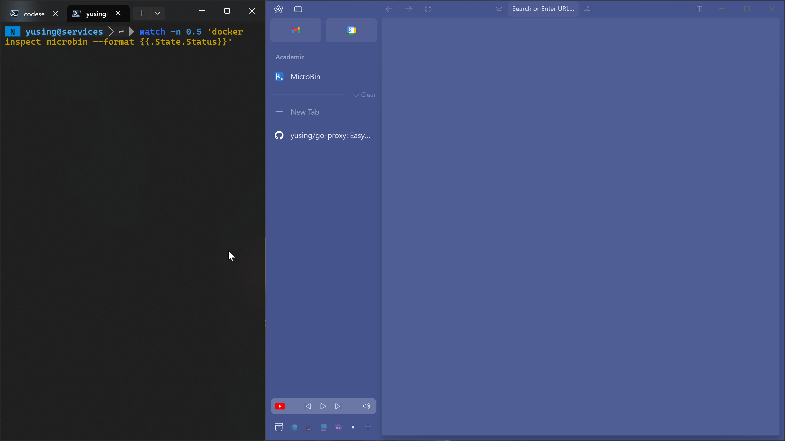

# go-proxy

[](https://sonarcloud.io/summary/new_code?id=yusing_go-proxy)
[](https://sonarcloud.io/summary/new_code?id=yusing_go-proxy)
[](https://sonarcloud.io/summary/new_code?id=yusing_go-proxy)
[](https://sonarcloud.io/summary/new_code?id=yusing_go-proxy)
[](https://sonarcloud.io/summary/new_code?id=yusing_go-proxy)
[](https://discord.gg/umReR62nRd)

[繁體中文文檔請看此](README_CHT.md)

A lightweight, easy-to-use, and [performant](docs/benchmark_result.md) reverse proxy with a web UI.

## Table of content

<!-- TOC -->

- [go-proxy](#go-proxy)
  - [Table of content](#table-of-content)
  - [Key Points](#key-points)
  - [Getting Started](#getting-started)
    - [Setup](#setup)
    - [Commands line arguments](#commands-line-arguments)
    - [Environment variables](#environment-variables)
    - [Use JSON Schema in VSCode](#use-json-schema-in-vscode)
    - [Config File](#config-file)
    - [Include Files](#include-files)
  - [Showcase](#showcase)
    - [idlesleeper](#idlesleeper)
  - [Build it yourself](#build-it-yourself)

## Key Points

-   Easy to use
    -   Effortless configuration
    -   Simple multi-node setup
    -   Error messages is clear and detailed, easy troubleshooting
-   Auto SSL cert management (See [Supported DNS Challenge Providers](docs/dns_providers.md)) 
-   Auto configuration for docker containers
-   Auto hot-reload on container state / config file changes
-   **idlesleeper**: stop containers on idle, wake it up on traffic _(optional, see [showcase](#idlesleeper))_
-   HTTP(s) reserve proxy
-   TCP and UDP port forwarding
-   Web UI for configuration and monitoring (See [screenshots](https://github.com/yusing/go-proxy-frontend?tab=readme-ov-file#screenshots))
-   Supports linux/amd64, linux/arm64, linux/arm/v7, linux/arm/v6 multi-platform
-   Written in **[Go](https://go.dev)**

[🔼Back to top](#table-of-content)

## Getting Started

### Setup

1.  Pull docker image 
    
    ```shell
    docker pull ghcr.io/yusing/go-proxy:latest
    ```

2.  Create new directory, `cd` into it, then run setup

    ```shell
    docker run --rm -v .:/setup ghcr.io/yusing/go-proxy /app/go-proxy setup
    ```

3.  Setup DNS Records point to machine which runs `go-proxy`, e.g.

    -   A Record: `*.y.z` -> `10.0.10.1`
    -   AAAA Record: `*.y.z` -> `::ffff:a00:a01`

4.  Setup `docker-socket-proxy` other docker nodes _(if any)_ (see [example](docs/docker_socket_proxy.md)) and then them inside `config.yml`

5.  Done. You may now do some extra configuration
    -   With text editor (e.g. Visual Studio Code)
    -   With Web UI via `gp.y.z`
    -   For more info, [See docker.md](docs/docker.md)

[🔼Back to top](#table-of-content)

### Commands line arguments

| Argument    | Description                      | Example                    |
| ----------- | -------------------------------- | -------------------------- |
| empty       | start proxy server               |                            |
| `validate`  | validate config and exit         |                            |
| `reload`    | trigger a force reload of config |                            |
| `ls-config` | list config and exit             | `go-proxy ls-config \| jq` |
| `ls-route`  | list proxy entries and exit      | `go-proxy ls-route \| jq`  |

**run with `docker exec go-proxy /app/go-proxy <command>`**

### Environment variables

| Environment Variable           | Description                                 | Default          | Values        |
| ------------------------------ | ------------------------------------------- | ---------------- | ------------- |
| `GOPROXY_NO_SCHEMA_VALIDATION` | disable schema validation                   | `false`          | boolean       |
| `GOPROXY_DEBUG`                | enable debug behaviors                      | `false`          | boolean       |
| `GOPROXY_HTTP_ADDR`            | http server listening address               | `:80`            | `[host]:port` |
| `GOPROXY_HTTPS_ADDR`           | https server listening address (if enabled) | `:443`           | `[host]:port` |
| `GOPROXY_API_ADDR`             | api server listening address                | `127.0.0.1:8888` | `[host]:port` |

### Use JSON Schema in VSCode

Copy [`.vscode/settings.example.json`](.vscode/settings.example.json) to `.vscode/settings.json` and modify it to fit your needs

[🔼Back to top](#table-of-content)

### Config File

See [config.example.yml](config.example.yml)

[🔼Back to top](#table-of-content)

### Include Files

These are files that include standalone proxy entries

See [Fields](docs/docker.md#fields)

See [providers.example.yml](providers.example.yml) for examples

[🔼Back to top](#table-of-content)

## Showcase

### idlesleeper



[🔼Back to top](#table-of-content)

## Build it yourself

1. Clone the repository `git clone https://github.com/yusing/go-proxy --depth=1`

2. Install / Upgrade [go (>=1.22)](https://go.dev/doc/install) and `make` if not already

3. Clear cache if you have built this before (go < 1.22) with `go clean -cache`

4. get dependencies with `make get`

5. build binary with `make build`

[🔼Back to top](#table-of-content)
